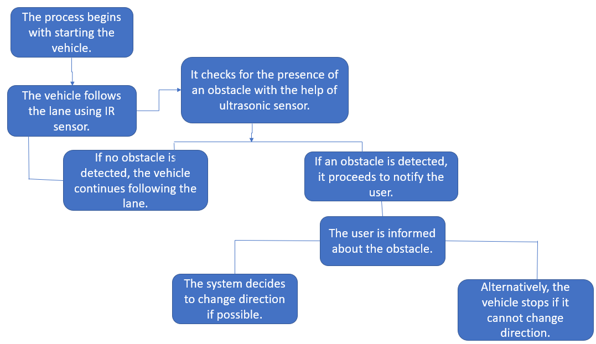
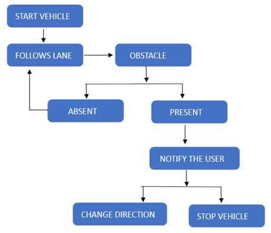
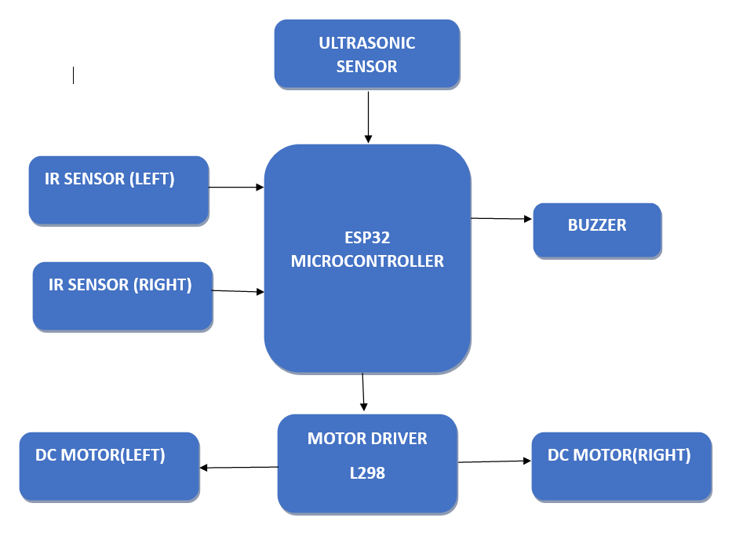
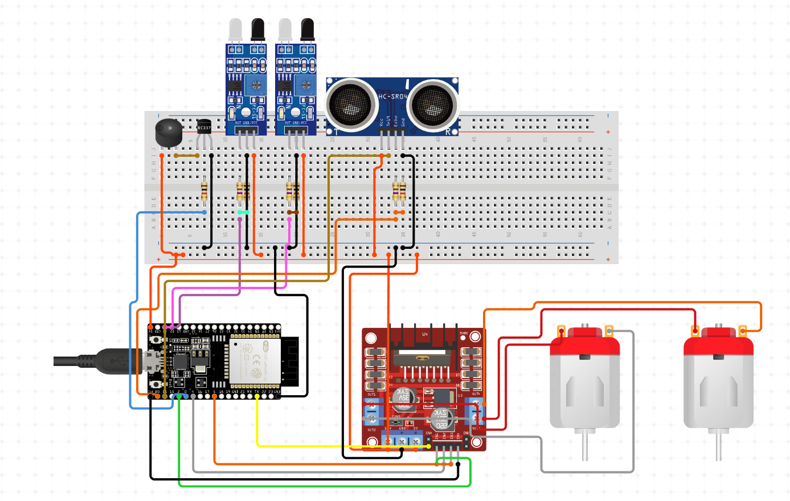
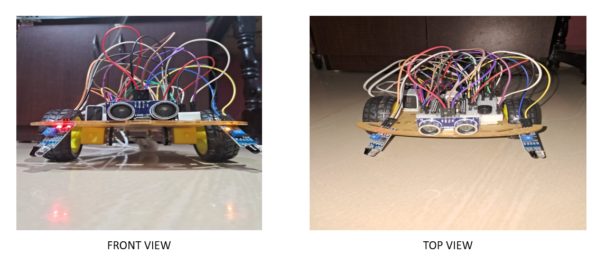

# SMART_DRIVING_ASSISTANT-SYSTEM
A real-time obstacle and lane detection system using ESP32, ultrasonic and IR sensors. Designed for smart transportation and automation applications.
#### Functional flow

---

## 👩‍💻 Team Members
- Vaishnavi Sanjay Kadolkar (02FE22BEC115)
- Santoshi Uppin (02FE22BEC085)
- Swaroop Patil (02FE23BEC401)
- Swayam Mane (02FE22BEC113)

**Guide:** Prof. Vinayak Dalavi

---

## 🛠️ Features
- Obstacle detection using HC-SR04 Ultrasonic sensors
- Lane following using IR sensors
- ESP32 for real-time data processing
- Buzzer alerts for safety
- DC motors controlled via L298N Motor Driver
- Simulations using Proteus
#### Flowchart

---

## 🧰 Tech Stack
- ESP32 Microcontroller
- Arduino IDE (C++ based)
- Proteus for simulation
- Hardware tools: Ultrasonic sensor, IR sensor, DC motors, Buzzer, L298N driver
#### Block diagram

---

---

## ⚙️ How to Run

### 🧪 Hardware Setup
1. Connect ultrasonic and IR sensors to ESP32 GPIOs.
2. Connect motors via L298N driver.
3. Use a stable 12V power supply.
#### Circuit diagram

### 💻 Uploading Code
1. Open Arduino IDE.
2. Select the correct board and port.
3. Upload `SmartDrivingAssistant.ino`.

### 🧩 Simulation
1. Open Proteus.
2. Load the `.pdsprj` simulation file from `simulation/`.

---

## 📊 Results
- Obstacle detection within 2–40 cm range.
- Accurate lane tracking on high-contrast surfaces.
- Low power consumption (≈150mA).
- Scalable system design for industrial or vehicle applications.
#### Implementation

---

## 🚀 Future Scope
- Add camera-based lane tracking.
- Enable V2V and V2I communication.
- Cloud-based GPS tracking.
- AI-based driver alertness monitoring.

